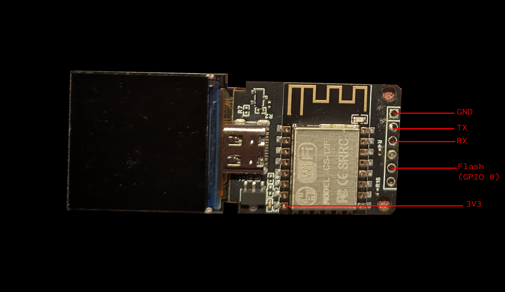

# How to backup and restore ESP8266 flash

## 1. Connect to the ESP8266
Use a USB-to-TTL Serial Adapter or another ESP device to connect to your ESP8266 with this wires :

<div align="center">
   
   <br>
   <em>Pin Wiring Diagram</em>
</div>

## 2. Enter boot bode
Power on the ESP8266 while holding GPIO0 (Flash) connected to GND

This puts the device into flash mode

## 3. Run the backup script
Execute `backup.sh` and follow the process until completion

> If the read operation fails (common with dupont wiring), unplug and replug the ESP8266, then retry extracting the chunk (just press enter)

## 3.2. Fix chunk order

In some cases (but not 100%), use `fix_backup_order.py` to correct the order of the backup chunks

## 5. Restore the Flash (if needed)

To reflash the ESP8266 with your backup:

- Connect the ESP8266 using the same wiring as for the backup
- Run the following command:
    ```
    esptool.py --port /dev/ttyUSB0 --baud 115200 write_flash 0x00000 yourbackup.bin
    ```
